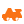

# Live map icon gallery

The live map now shares its vector icon set as standalone SVG files so you can preview the artwork outside of the application. Each glyph below is shown at 96px for clarity, though the in-game map dynamically masks and recolors them based on zoom.

<table>
  <thead>
    <tr>
      <th>Icon key</th>
      <th>Preview</th>
    </tr>
  </thead>
  <tbody>
    <tr><td><code>map-pin</code></td><td></td></tr>
    <tr><td><code>oil-rig</code></td><td></td></tr>
    <tr><td><code>sphere-tank</code></td><td></td></tr>
    <tr><td><code>lighthouse</code></td><td></td></tr>
    <tr><td><code>harbor</code></td><td></td></tr>
    <tr><td><code>rocket</code></td><td></td></tr>
    <tr><td><code>airfield</code></td><td></td></tr>
    <tr><td><code>train-yard</code></td><td></td></tr>
    <tr><td><code>train-station</code></td><td></td></tr>
    <tr><td><code>power-plant</code></td><td></td></tr>
    <tr><td><code>military</code></td><td></td></tr>
    <tr><td><code>bandit</code></td><td></td></tr>
    <tr><td><code>satellite</code></td><td></td></tr>
    <tr><td><code>junkyard</code></td><td></td></tr>
    <tr><td><code>ranch</code></td><td></td></tr>
    <tr><td><code>fishing</code></td><td></td></tr>
    <tr><td><code>gas-station</code></td><td></td></tr>
    <tr><td><code>store</code></td><td></td></tr>
    <tr><td><code>excavator</code></td><td></td></tr>
    <tr><td><code>cargo-ship</code></td><td></td></tr>
    <tr><td><code>patrol-helicopter</code></td><td></td></tr>
  </tbody>
</table>

